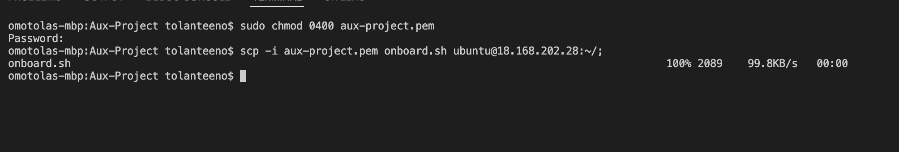
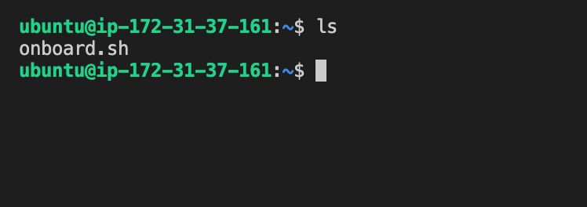
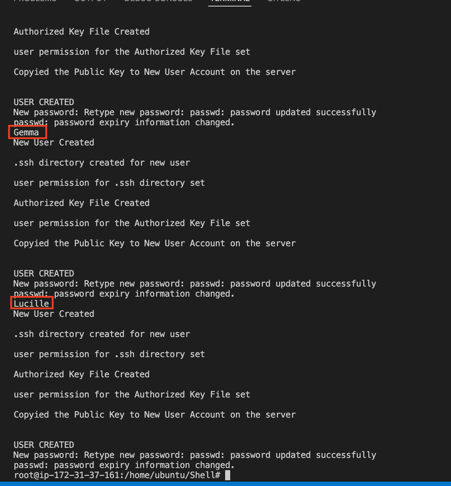
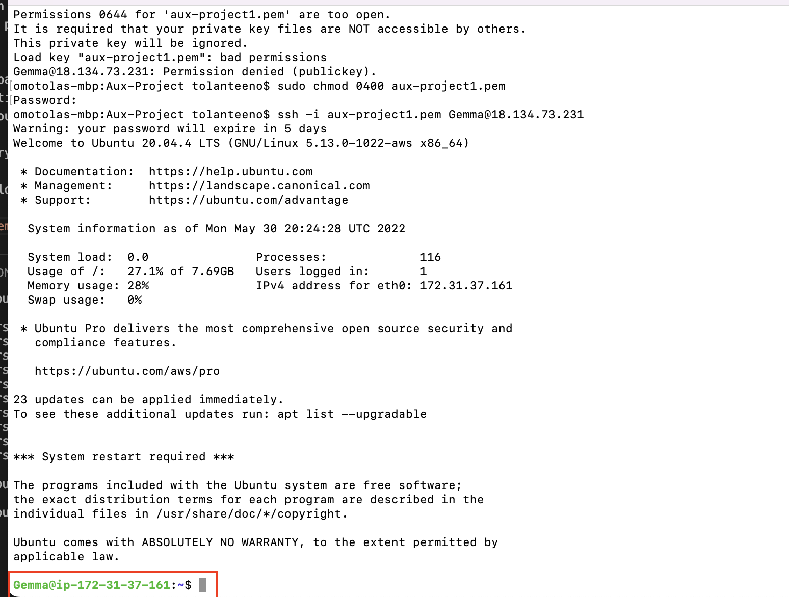
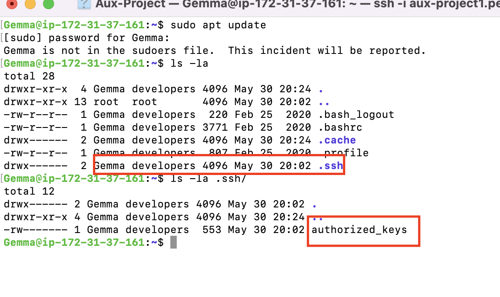
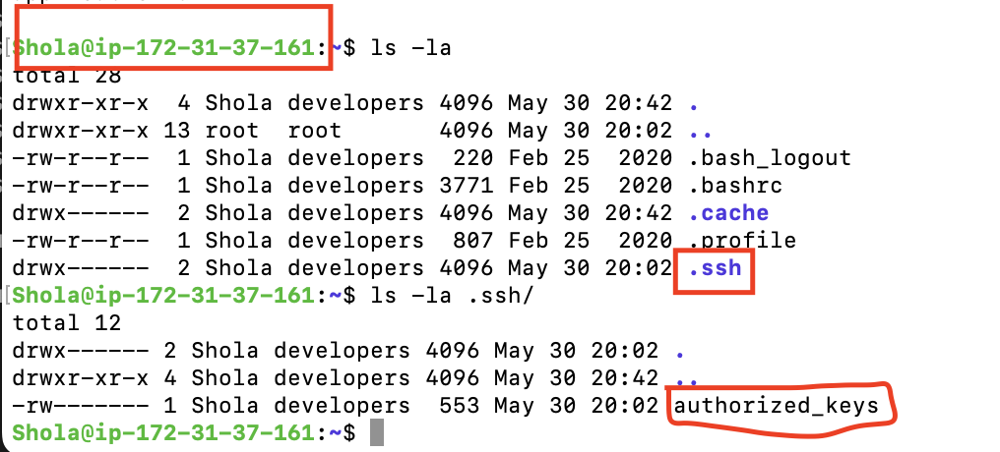
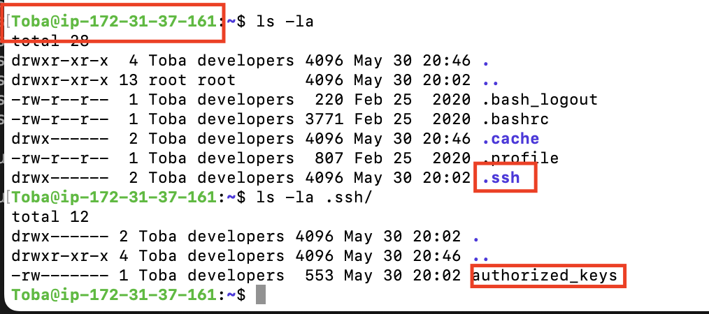

### AUX PROJECT 1: SHELL SCRIPTING
Note that the shell script that was created and used for this project can be found here:

[SCRIPT FOR THE PROJECT](https://link-url-here.org)

Upon creating the script, the script was copied to the AWS server as shown in snapshot below:

Upon running the `ls` command, you can see the script is now loaded on the ubuntu server below:

Sucessfully running the script with the command `./onboard.sh` see snapshot below:

Highlighted above are some of the users created eg. Gemma and Lucille. You can see for each user, a .ssh directory was created, user permission for .ssh directory was set, an authrized key file was crearted, user permission for the authorised key file was set and the public key was copied into a file for the new user account onthe server. These will be showed in consequent snapshots. 

#### Testing users randomly
Note that the public key has been copied into the home folder for each user on the server into the Authorized keys file. We need the private key file to be able to connect to the server

Below are the users that were created on the remove server. You an see they are all in the developers group.

The first thing is to paste the private key that was given in the documentation into a file called `aux-project1.pem` on our host computer

The first test is to try to connect as 'Gemma'

Type in the command below:

`ssh -i aux-project1.pem Gemma@18.134.73.231`

Below shows sucessful connection to the remote server as user `Gemma`

You can see from the screen show below that a .ssh folder has been created for Gemma under home and within that .ssh folder is an authorized_keys file containing the public keys

Next I will try to connect as `Shola` by running the code below:

`ssh -i aux-project1.pem Shola@18.134.73.231`
 
 Below shows suscessful connection as `Shola` as well as the home folder contaning the .ssh folder within which there is a authorized_keys file contaning the public keys

 

Again, I will try to connect as `Toba` by running the code below:

`ssh -i aux-project1.pem Toba@18.134.73.231`
 
 Below shows suscessful connection as `Toba` as well as the home folder contaning the .ssh folder within which there is a authorized_keys file contaning the public keys

 